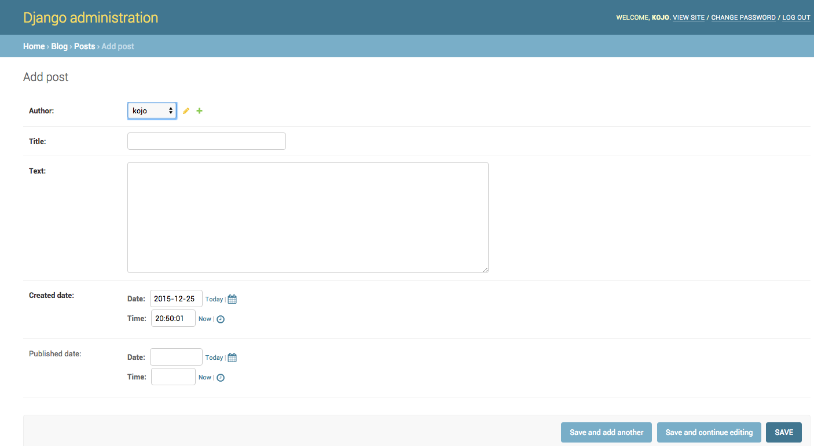

# Django Admin

Para adicionar, editar e deletar os posts que acabamos de modelar, nós usaremos o admin do Django.

Vamos abrir o arquivo `blog/admin.py` e substituir seu conteúdo por isso:

blog/admin.py

```python
from django.contrib import admin
from .models import Post

admin.site.register(Post)
```

Como você pode ver, nós importamos (incluímos) o modelo Post definido no capítulo anterior. Para tornar nosso modelo visível na página de administração, precisamos registrá-lo com `admin.site.register(Post)`.

Agora você precisará fazer a criação de um *superusuário (superuser)* - uma conta de usuário que pode controlar tudo no site. Então, no terminal digite `python3 manage.py createsuperuser` e aperte Enter.

Mac OS X ou Linux:

    ~/djangogirls$ python3 manage.py createsuperuser


Windows:

    C:\Users\Name\djangogirls> python manage.py createsuperuser

Quando for solicitado, insira seu nome de usuário (letras minúsculas, sem espaços), e-mail e senha. **Não se preocupe se você não conseguir ver a senha que está digitando – é assim que tem ser.** Basta digitá-la e clicar `enter` para continuar. A saída deve parecer com isso (onde o nome de usuário e o email devem ser os seus):

    Username: admin
    Email address: admin@admin.com
    Password:
    Password (again):
    Superuser created successfully.

OK, hora de olhar para o nosso modelo de Post. Lembre-se de executar `python3 manage.py runserver` no terminal para iniciar o servidor web. Vá para o seu navegador e digite o endereço http://127.0.0.1:8000/admin/. Você verá uma página de login como essa:


Faça login com as credenciais de superusuário que você escolheu; você deverá ver o painel de controle de administração do Django.


Vá para Posts e brinque um pouco por lá. Adicione cinco ou seis posts. Não se preocupe com o conteúdo - você pode simplesmente copiar e colar algum texto desse tutorial para economizar tempo. :)

Certifique-se de que pelo menos duas ou três postagens (mas não todas) têm a data de publicação definida. Isso será útil depois.



Se você quiser saber mais sobre o Django admin, confira a documentação do Django: https://docs.djangoproject.com/en/2.0/ref/contrib/admin/

Esse provavelmente é um bom momento para pegar um café (ou chá) ou algo para comer para recuperar as energias. Você criou seu primeiro modelo em Django e merece uma pausa!
