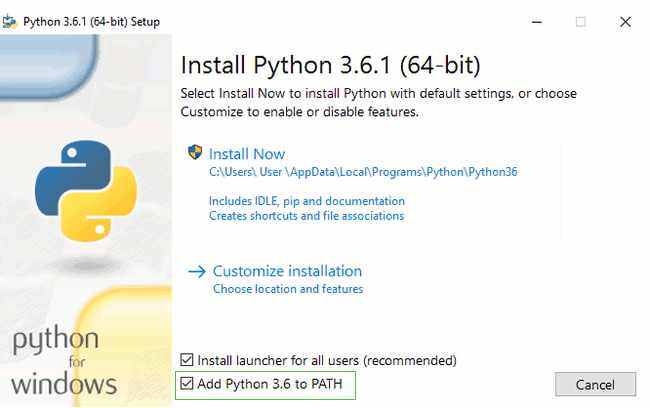

<!--sec data-title="Install Python: Windows" data-id="python_windows" data-collapse=true ces-->

Primeiro, verifique se o computador está executando a versão 32-bit ou a versão 64-bit do Windows. Faça isso pressionando a tecla do windows no seu teclado (aquela com a janela do windows) + a tecla Pause/Break. Feito isso, uma tela abrirá com as informações do seu windows. Nessa tela, verifique a seção "Tipo de sistema" e confira que versão está sendo executada. Você pode baixar o Python para Windows no website https://www.python.org/downloads/windows/. Clique no link: "Versão Mais Recente Python 3 - Python x.x.x". Se seu computador está executando a versão **64-bit** do windows, baixe o **instalador executável do Windows x86-64**. Caso contrário, baixe o **instalador executável x86 do Windows**. Depois de baixar o instalador, você precisa executá-lo (dando um duplo-clique nele) e seguir as instruções.

Existe uma coisa com a qual você precisa ter cuidado: durante a instalação, você verá uma janela marcada como "Setup". Certifique-se de selecionar a caixa "Adicionar Python 3.6 ao CAMINHO" e clique em "Instalar agora", conforme mostrado aqui:

Nas próximas etapas, você usará a linha de comando do Windows (vamos te explicar tudo sobre isso também). Por enquanto, se você precisa digitar alguns comandos, vá ao menu iniciar e digite "Command Prompt" no campo de busca. (Em versões mais antigas do Windows, é possível iniciar a linha de comando com Start menu → Sistema do Windows → Prompt de comando.) Você também pode segurar a tecla windows + "R" até aparecer a janela "Executar". Para abrir a Linha de Comando, digite "cmd" e pressione enter na janela "Executar".

<0>Observação:</0> se você estiver usando uma versão antiga do Windows (7, Vista, ou qualquer outra mais antiga) e o instalador do 3.6. x Python falhar com um erro, você pode tentar:

1. instalar todas as atualizações do Windows e tentar instalar o Python 3.6 novamente; ou
2. instalar uma [versão mais antiga do Python](https://www.python.org/downloads/windows/), por exemplo, [3.4.6](https://www.python.org/downloads/release/python-346/).

Se você instalar uma versão mais antiga do Python, a tela de instalação pode parecer um pouco diferente da mostrada acima. Certifique-se de rolar até ver a opção "Add python.exe to Path", então clique no botão à esquerda e escolha "Will be installed on local hard drive":

<!--endsec-->

Verifique se a instalação foi bem sucedida abrindo o terminal e digitando o comando `python3`:

command-line

    $ python3 --version
    Python 3.6.1

**Observação:** Se você estiver no Windows e receber uma mensagem de erro dizendo queo `python3` não foi encontrado, tente utilizar `python` (sem o `3`) e verifique se ela corresponde à versão Python 3.6.

* * *

Se você tem alguma dúvida ou se alguma coisa deu errado e você não tem a menor ideia do que fazer, pergunte à sua monitora! Nem sempre tudo sai conforme o esperado e é melhor pedir ajuda a alguém mais experiente.
